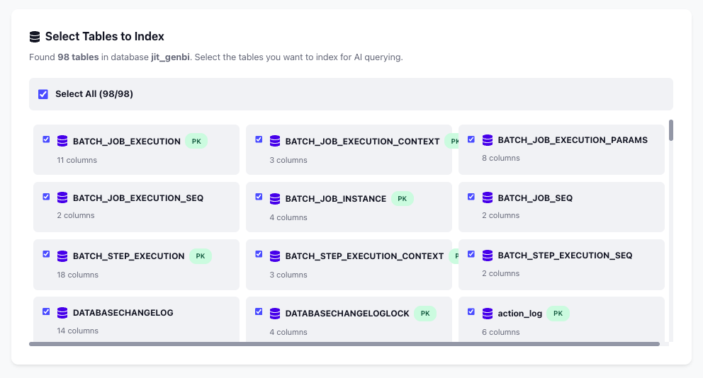
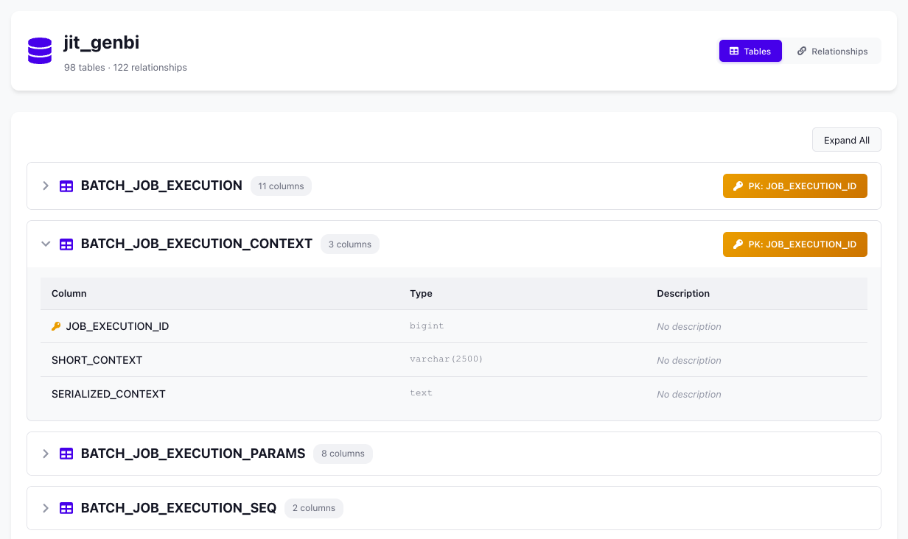

<div align="center">
  
</div>

<h1 align="center"> Tiny GenBI - Open-Source GenBI Lightweight Agent</h1>

<div align="center">
  
  
  
  
  
  
  
  
  
  
  
  
  
  
  
  
</div>

> ✨​ Lightweight (but powerful 💪​) system that leverages LLMs and Agents to generate SQL queries from natural language questions and answer in natural language. The system performs RAG by indexing db schemas, SQL-pairs and user Instructions using vector similarity search to provide context-aware query generation.

## 📋 Summary

- [⚠️ Important Notice - Proof of Concept](#️-important-notice---proof-of-concept)
- [Features](#features)
- [Web Interface](#web-interface)
- [Architecture](#architecture)
- [Prerequisites](#prerequisites)
- [Quick Start (Local Development)](#quick-start-local-development)
- [Docker Deployment](#docker-deployment)
- [Project Structure](#project-structure)
- [API Documentation](#api-documentation)
- [Using Local LLMs (Ollama)](#using-local-llms-ollama)
- [Troubleshooting](#troubleshooting)
- [Security Notes](#security-notes)
- [Future Improvements](#future-improvements)
- [Contributing](#contributing)
- [License](#license)
- [Support](#support)

## ⚠️ Important Notice - Proof of Concept

**This project is a Proof of Concept (PoC) and is NOT production-ready.**

This is a functional demonstration of Text-to-SQL capabilities with the following considerations:

- 🧪 **Development Stage**: Built as a PoC to explore and validate the concept
- ⚡ **Not Optimized**: Performance optimization has not been a priority
- 🔧 **Improvements Needed**: Many areas can be enhanced (see "Future Improvements" section below)
- 🐛 **Limited Testing**: Not extensively tested in production scenarios
- 📊 **Scalability**: Not designed for high-load production environments
- 🔒 **Security**: While read-only query validation is implemented, additional security hardening is needed for production use

**Use this project for:**
- Learning and experimentation
- Internal development tools
- Prototyping and demos
- Understanding Text-to-SQL architectures

**Before production deployment:**
- Conduct thorough security audits
- Implement comprehensive error handling
- Add monitoring and logging infrastructure
- Performance testing and optimization
- Add rate limiting and request throttling
- Implement user authentication and authorization
- Add comprehensive unit and integration tests

## Features

- 🔍 **Natural Language to SQL**: Convert questions in natural language to SQL queries
- 🗄️ **MySQL Schema Discovery**: Automatically discover and index database schemas
- 🔐 **Secure Credentials Management**: Encrypted storage for database credentials
- 🔒 **Query Security**: Built-in validation that allows only read-only operations (SELECT, SHOW, DESCRIBE). No data modification possible.
- 🧠 **RAG-Powered Generation**: Uses Retrieval-Augmented Generation with vector embeddings for context-aware SQL generation
- 📚 **SQL Pairs & Instructions**: Store example queries and domain knowledge in the vector store
- 🔌 **Flexible LLM Support**: Works with OpenAI, Anthropic, or local LLMs (Ollama)
- 🌐 **Modern Web UI**: React-based interface for easy interaction
- 🐳 **Docker Support**: Easy deployment with Docker and Docker Compose

## Web Interface

The application provides an intuitive web interface for interacting with your MySQL databases:

<div align="center">
  
</div>

The web UI includes:
- **Ask Questions**: Natural language query interface with database selection
- **Database Management**: View and manage your connected MySQL databases
- **Knowledge Base**: Manage SQL pairs, domain instructions, and examples
- **Settings**: Configure API endpoints and system preferences

## Architecture

- **Backend**: FastAPI (Python) for API endpoints and query processing
- **Frontend**: React + Vite for the web interface
- **Vector Store**: FAISS for efficient similarity search
- **Database**: MySQL (client for schema discovery and query execution)

### RAG-Based Query Generation

This application uses **Retrieval-Augmented Generation (RAG)** to improve SQL query generation:

1. **Schema Indexing**: Database schemas (tables, columns, relationships) are converted into text embeddings and stored in a FAISS vector store
2. **SQL Pairs & Instructions**: The system can store:
   - **SQL Pairs**: Example questions with their corresponding SQL queries
   - **Domain Instructions**: Business rules and domain-specific knowledge
   - **Relationships**: Foreign key relationships and table connections
3. **Contextual Retrieval**: When a user asks a question:
   - The question is embedded using the same embedding model
   - Similar schema elements, SQL examples, and instructions are retrieved via vector similarity search
   - The most relevant context is provided to the LLM
4. **Enhanced Generation**: The LLM generates SQL queries using:
   - Retrieved schema information
   - Similar example queries
   - Domain-specific instructions
   - Database relationship context

This RAG approach significantly improves query accuracy by providing the LLM with relevant context from your specific database schema and historical queries.

### Schema Auto-Indexing Interface

The application provides a user-friendly interface for selecting and indexing database tables:

<div align="center">
  
  <p><em>Select which tables to index for AI querying</em></p>
</div>

<div align="center">
  
  <p><em>Detailed schema information with tables, columns, and relationships</em></p>
</div>

The schema indexing process includes:
- **Table Selection**: Choose specific tables to index or select all tables
- **Schema Discovery**: Automatically analyze table structures, columns, and data types
- **Relationship Detection**: Identify foreign key relationships between tables
- **Vector Storage**: Convert schema information into embeddings for efficient retrieval
- **Interactive Visualization**: Browse indexed schemas with expandable table details

## Prerequisites

- Python 3.9+
- Node.js 18+ and npm
- MySQL database to connect to
- API key for OpenAI/Anthropic OR a local LLM (Ollama)

## Quick Start (Local Development)

### 1. Clone the Repository

```bash
git clone https://github.com/walterwootz/tiny-genbi.git
cd tiny-genbi
```

### 2. Backend Setup

#### Create a Virtual Environment

```bash
python3 -m venv venv
source venv/bin/activate  # On macOS/Linux
# or
venv\Scripts\activate  # On Windows
```

#### Install Dependencies

```bash
pip install -r requirements.txt
```

#### Configure Environment Variables

Create a `.env` file in the root directory:

```env
# LLM Provider Settings (choose one)
LLM_PROVIDER=openai
LLM_MODEL=gpt-4
LLM_API_KEY=your-openai-api-key

# For Anthropic:
# LLM_PROVIDER=anthropic
# LLM_MODEL=claude-3-sonnet-20240229
# LLM_API_KEY=your-anthropic-api-key

# For Local LLM (Ollama):
# LLM_PROVIDER=local
# LLM_MODEL=llama2
# LLM_BASE_URL=http://localhost:11434/v1

# Embedding Settings
EMBEDDING_PROVIDER=openai
EMBEDDING_MODEL=text-embedding-3-small
EMBEDDING_API_KEY=your-openai-api-key

# API Settings
API_HOST=0.0.0.0
API_PORT=5556

# Optional Settings
DEBUG=false
LOG_LEVEL=INFO
```

#### Run the Backend

```bash
python src/main.py
```

The backend will start at `http://localhost:5556`

### 3. Frontend Setup

Open a new terminal window:

```bash
cd webui
npm install
npm run dev
```

The frontend will start at `http://localhost:5173`

### 4. Using the Application

1. Open your browser and navigate to `http://localhost:5173`
2. **Add Database Connection**:
   - Click on "Database Connections" in the sidebar
   - Enter your MySQL connection details (host, port, user, password, database)
   - Click "Save Connection"
3. **Index Database Schema**:
   - Select your database connection
   - Click "Index Database" to analyze and store the schema
   - The system will create vector embeddings of tables, columns, and relationships
   - These embeddings are stored in the FAISS vector store for fast retrieval
4. **Ask Questions**:
   - Go to the "Ask" section
   - Select your indexed database
   - Type your question in natural language (e.g., "Show me all customers from Italy")
   - The system retrieves relevant schema context via RAG and generates the SQL query
   - The query is validated and executed automatically

## Docker Deployment

For production deployment using Docker, see the [Docker Setup Guide](./docker/README.md).

Quick start with Docker Compose:

```bash
cd docker
docker-compose up -d
```

## Project Structure

```
tiny-genbi/
├── src/                      # Backend source code
│   ├── main.py              # FastAPI application entry point
│   ├── api.py               # API endpoints
│   ├── config.py            # Configuration management
│   ├── models.py            # Pydantic models
│   ├── services/            # Business logic services
│   │   ├── credentials_store.py
│   │   ├── knowledge_base.py
│   │   ├── mysql_discovery.py
│   │   └── query_executor.py
│   └── pipelines/           # Processing pipelines
│       ├── indexing.py
│       └── generation.py
├── webui/                   # Frontend React application
│   ├── src/
│   │   ├── components/     # React components
│   │   ├── App.jsx         # Main application component
│   │   └── main.jsx        # Entry point
│   └── package.json
├── docker/                  # Docker configuration
│   ├── docker-compose.yml
│   └── README.md
├── data/                    # Data storage (created at runtime)
│   ├── indexed_dumps/      # Database schema dumps
│   └── vector_store/       # FAISS vector indices
├── Dockerfile              # Multi-stage Docker build
├── requirements.txt        # Python dependencies
├── .env                    # Environment configuration (create this)
└── README.md              # This file
```

## API Documentation

Once the backend is running, visit:
- **Swagger UI**: `http://localhost:5556/docs`
- **ReDoc**: `http://localhost:5556/redoc`

## Using Local LLMs (Ollama)

To use a local LLM instead of commercial APIs:

1. Install Ollama from [ollama.ai](https://ollama.ai)
2. Pull a model: `ollama pull llama2`
3. Configure your `.env`:
   ```env
   LLM_PROVIDER=local
   LLM_MODEL=llama2
   LLM_BASE_URL=http://localhost:11434/v1
   EMBEDDING_PROVIDER=local
   EMBEDDING_BASE_URL=http://localhost:11434/v1
   ```

## Troubleshooting

### Backend doesn't start
- Check if port 5556 is already in use
- Verify Python virtual environment is activated
- Ensure all dependencies are installed: `pip install -r requirements.txt`

### Frontend doesn't connect to backend
- Verify backend is running at `http://localhost:5556`
- Check browser console for CORS errors
- Ensure the API URL in the frontend matches the backend port

### Database connection fails
- Verify MySQL server is running and accessible
- Check firewall settings
- Ensure credentials are correct
- Test connection with: `python test_credentials.py`

### Vector store errors
- The `data/` directory will be created automatically
- Ensure write permissions in the project directory
- Clear vector store: `rm -rf data/vector_store/*`

## Security Notes

### Query Security
- **Read-Only Access**: The system validates ALL queries and allows only read-only operations:
  - ✅ Allowed: `SELECT`, `SHOW`, `DESCRIBE`, `EXPLAIN`
  - ❌ Blocked: `INSERT`, `UPDATE`, `DELETE`, `DROP`, `CREATE`, `ALTER`, `TRUNCATE`, and any other data modification operations
- **Multi-Query Protection**: Multiple statements in a single query are blocked to prevent SQL injection
- **Dangerous Pattern Detection**: Queries with file operations (`INTO OUTFILE`, `LOAD_FILE`) are blocked
- **Validation at Multiple Levels**:
  - During SQL generation by the LLM
  - Before query execution
  - No query can bypass these security checks

### Credentials Security
- Database credentials are encrypted using Fernet (symmetric encryption)
- The encryption key is stored in `.credentials_key` (keep this file secure)
- Never commit `.env`, `.credentials_key`, or `credentials.enc` to version control
- Use environment variables for sensitive configuration in production

### Best Practices
- Grant the MySQL user only SELECT privileges on the databases you want to query
- Use a dedicated read-only MySQL user for this application
- Keep your LLM API keys secure and rotate them regularly
- Regularly update dependencies to patch security vulnerabilities

## Future Improvements

This PoC has many opportunities for enhancement:

### Performance & Scalability
- **Caching Layer**: Implement Redis/Memcached for frequently asked questions
- **Query Result Caching**: Cache query results to reduce database load
- **Connection Pooling**: Implement proper connection pooling for MySQL
- **Async Operations**: Improve async handling for concurrent requests
- **Vector Store Optimization**: Optimize FAISS indices for faster retrieval
- **Lazy Loading**: Implement pagination and lazy loading in the UI

### Security & Production Readiness
- **Authentication & Authorization**: Add user management and role-based access control
- **API Rate Limiting**: Prevent abuse with rate limiting per user/IP
- **Audit Logging**: Track all queries and user actions
- **Session Management**: Implement secure session handling
- **Input Sanitization**: Enhanced input validation beyond SQL queries
- **HTTPS/TLS**: Enforce encrypted connections
- **Secret Management**: Use proper secret management (Vault, AWS Secrets Manager)

### Features & Functionality
- **Multi-Database Support**: PostgreSQL, SQLite, MS SQL Server support
- **Query History**: Save and retrieve previous queries per user
- **Favorites/Bookmarks**: Save frequently used queries
- **Export Options**: Export results to CSV, Excel, JSON
- **Query Visualization**: Charts and graphs for query results
- **Natural Language Results**: Better formatting of answers
- **Schema Versioning**: Track and handle schema changes over time
- **Custom Prompts**: Allow users to customize LLM prompts

### Code Quality
- **Comprehensive Testing**: Unit tests, integration tests, e2e tests
- **Error Handling**: More robust error handling and user-friendly messages
- **Logging Infrastructure**: Structured logging with log levels
- **Code Documentation**: API documentation, inline comments
- **Type Safety**: Stricter type hints throughout the codebase
- **Linting & Formatting**: Enforce code style with pre-commit hooks

### Monitoring & Observability
- **Metrics Collection**: Response times, error rates, usage statistics
- **Health Checks**: Comprehensive health checks for all components
- **Alerting**: Set up alerts for errors and performance issues
- **Distributed Tracing**: Trace requests across services
- **Dashboard**: Admin dashboard for system monitoring

### LLM Improvements
- **Prompt Engineering**: Refine prompts for better SQL generation
- **Few-Shot Learning**: Use more examples for better context
- **Model Fine-Tuning**: Fine-tune models on specific domain data
- **Multi-Model Support**: Compare results from different LLMs
- **Confidence Scores**: Provide confidence levels for generated queries

### UI/UX Enhancements
- **Better Error Messages**: User-friendly error explanations
- **Query Builder**: Visual query builder for non-technical users
- **Dark Mode**: Theme support
- **Mobile Responsive**: Better mobile experience
- **Accessibility**: WCAG compliance
- **Internationalization**: Multi-language support

## Contributing

Contributions are welcome! Please feel free to submit a Pull Request.

**Areas where contributions are especially welcome:**
- Implementing items from the "Future Improvements" list
- Bug fixes and performance improvements
- Documentation improvements
- Test coverage expansion
- Security enhancements

## License

This project is licensed under the **MIT License**.

This means you can:
- ✅ Use the software for any purpose (personal, commercial, etc.)
- ✅ Modify the software as you wish
- ✅ Distribute the software
- ✅ Use it in proprietary software
- ✅ No obligation to share your modifications

The only requirement is to include the original copyright notice and license in any copy or substantial portion of the software.

See the [LICENSE](LICENSE) file for full details.

## Support

For issues and questions, please open an issue on GitHub.

---

**Made with ❤️ for the data community**
